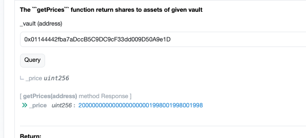
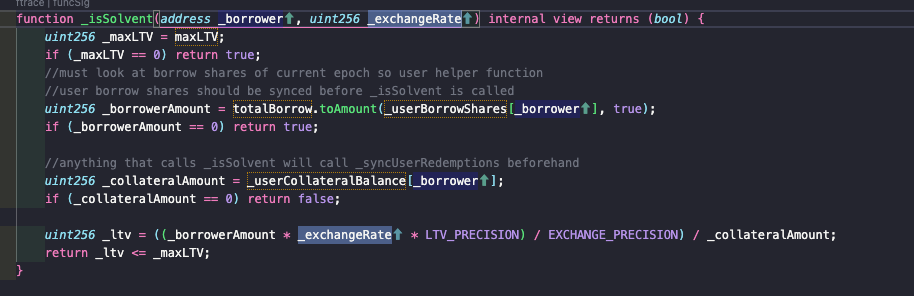
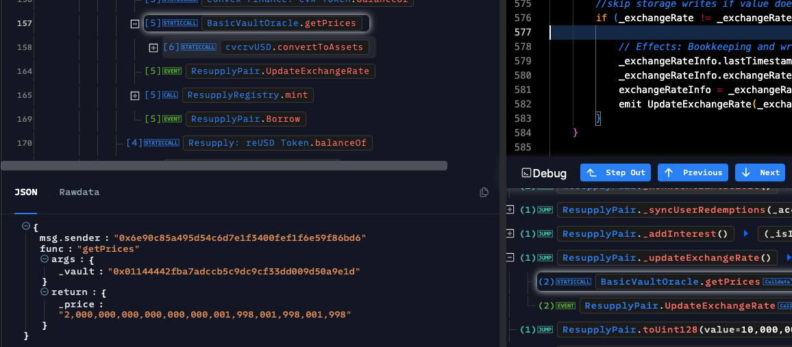
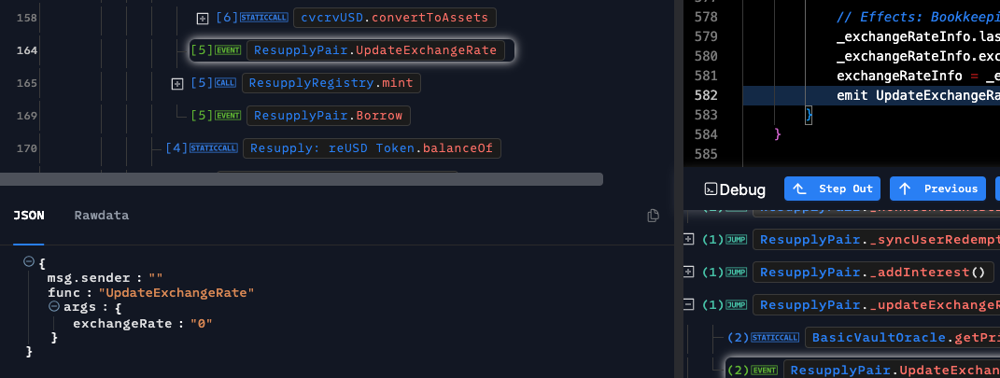
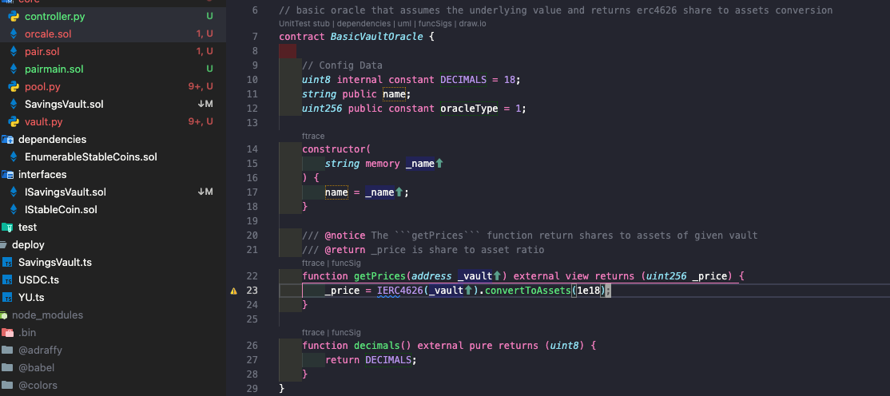
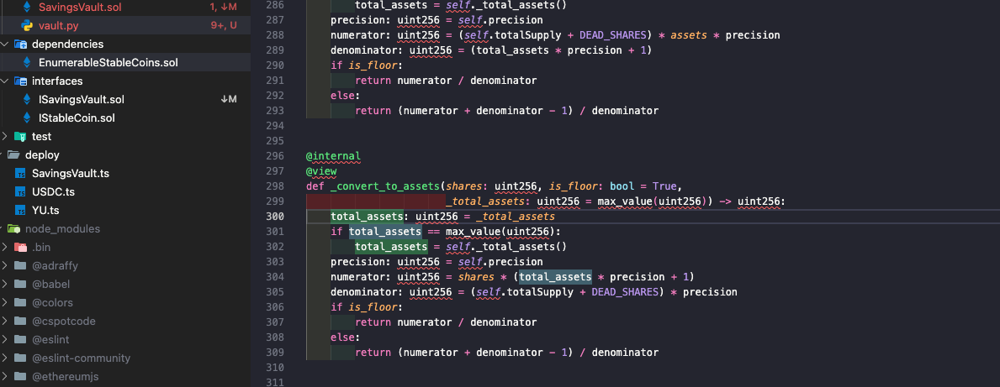
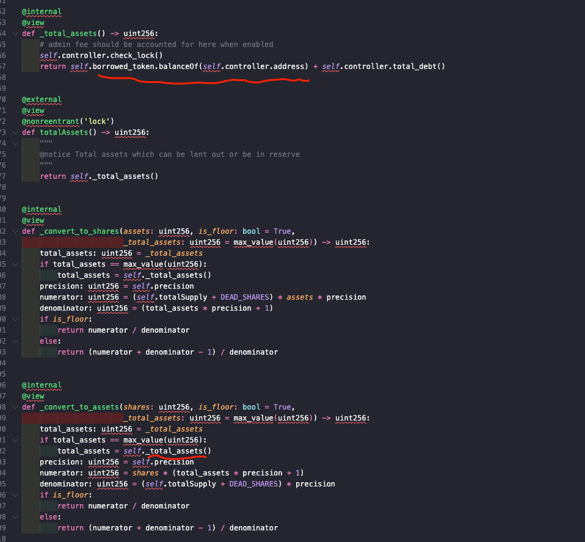

# resupply

<https://medium.com/@zhenyazhdarkin/from-1-wei-to-10m-reusd-anatomy-of-a-resupplypair-exploit-9e97748fdce1>

<https://app.blocksec.com/explorer/tx/eth/0xffbbd492e0605a8bb6d490c3cd879e87ff60862b0684160d08fd5711e7a872d3?line=157&debugLine=157>

<https://etherscan.io/address/0xcb7E25fbbd8aFE4ce73D7Dac647dbC3D847F3c82#readContract>

